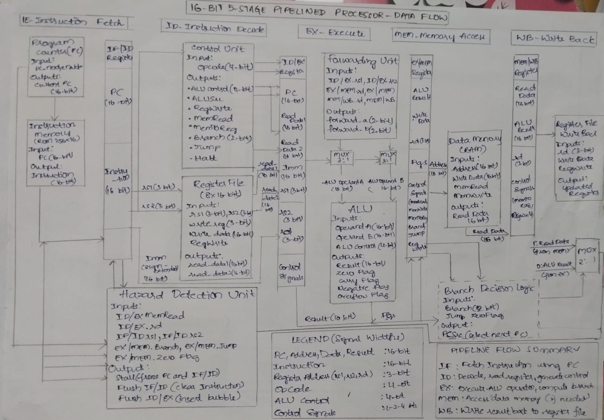
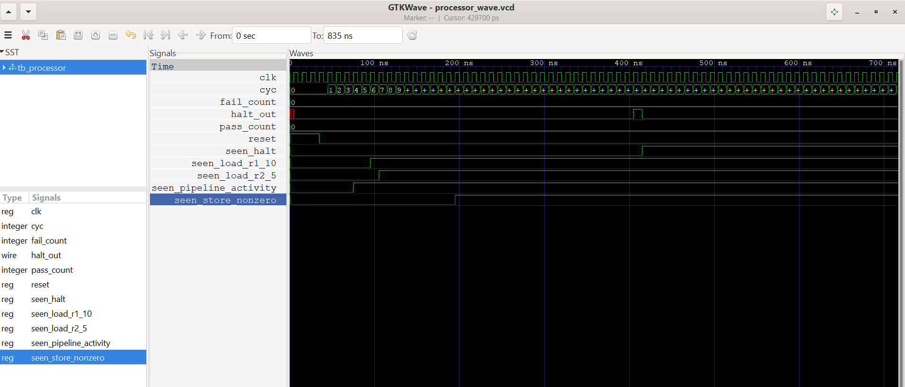
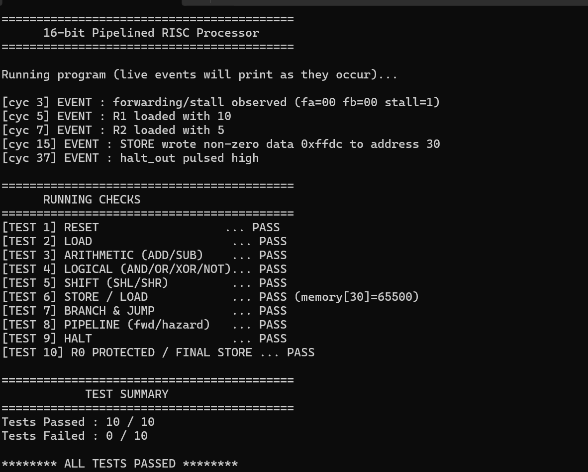

# 16-Bit Pipelined Processor

## Project Overview

This project builds a fully functional **16-bit processor** from scratch in Verilog HDL, featuring:

- 5-stage pipeline architecture (IF → ID → EX → MEM → WB)
- Custom 16-bit ISA with 15 instructions
- R-Type, I-Type, B-Type and J-Type instruction formats
- 8 general-purpose registers (R0 hardwired to zero)
- Full data forwarding to eliminate RAW stalls
- Load-use hazard detection with automatic stall insertion
- Branch resolution in MEM stage with pipeline flush
- Synchronous reset throughout all pipeline stages
- HALT instruction support
- Complete testbench with 7 verified test cases

The complete design is implemented using **Verilog HDL** and verified through simulation using **Icarus Verilog** and **GTKWave**.

---

## System Architecture





### Major Modules

| Module                  | Function                                          |
|-------------------------|---------------------------------------------------|
| Program Counter         | Tracks and updates current instruction address    |
| Instruction Memory      | ROM storing the program (256 × 16-bit words)      |
| Pipeline IF/ID          | Latches PC and instruction between IF and ID      |
| Control Unit            | Decodes opcode into all pipeline control signals  |
| Register File           | 8 × 16-bit registers with combinational read      |
| Pipeline ID/EX          | Latches decoded data and control into EX stage    |
| ALU                     | Performs 8 arithmetic and logic operations        |
| Pipeline EX/MEM         | Latches ALU result and flags into MEM stage       |
| Data Memory             | RAM for LOAD and STORE instructions               |
| Pipeline MEM/WB         | Latches memory/ALU result into WB stage           |
| Hazard Detection Unit   | Detects load-use hazards and branch conflicts     |
| Forwarding Unit         | Bypasses stale register values via mux selects    |

---

## Pipeline Flowchart

```
         ┌─────────────────────────────────────────────┐
         │                  RESET                       │
         └───────────────────┬─────────────────────────┘
                             │
                             ▼
         ┌─────────────────────────────────────────────┐
         │       IF — Fetch instruction at PC           │
         └───────────────────┬─────────────────────────┘
                             │ IF/ID register
                             ▼
         ┌─────────────────────────────────────────────┐
         │  ID — Decode opcode, read register file     │
         │       generate control signals              │
         └───────────────────┬─────────────────────────┘
                             │ ID/EX register
                             ▼
         ┌─────────────────────────────────────────────┐
         │  EX — Forwarding muxes → ALU operation      │
         │       Compute branch target address         │
         └───────────────────┬─────────────────────────┘
                             │ EX/MEM register
                             ▼
         ┌─────────────────────────────────────────────┐
         │  MEM — Data memory read/write               │
         │        Branch/jump resolution → update PC   │
         └───────────────────┬─────────────────────────┘
                             │ MEM/WB register
                             ▼
         ┌─────────────────────────────────────────────┐
         │  WB — Select ALU or memory result           │
         │       Write back to register file           │
         └───────────────────┬─────────────────────────┘
                             │
                    halt? ───┘
                    yes → assert halt_out
                    no  → back to IF
```

---

## Instruction Set Architecture

### Registers

| Register | Number | Description                      |
|----------|--------|----------------------------------|
| R0       | `000`  | Hardwired zero — always reads 0  |
| R1 – R6  | `001`–`110` | General purpose             |
| R7       | `111`  | General purpose / link register  |

### Instruction Formats

```
R-Type:  [15:12] opcode | [11:9] rd | [8:6] rs1 | [5:3] rs2 | [2:0] unused
I-Type:  [15:12] opcode | [11:9] rd | [8:0] imm9
B-Type:  [15:12] Opcode | [11:9] rs1 | [8:6] rs2 | [5:0] offset6
J-Type:  [15:12] opcode | [11:0] imm12
```

### Opcode Table

| Opcode | Mnemonic | Type | Operation                                          |
|--------|----------|------|----------------------------------------------------|
| `0000` | ADD      | R    | `rd = rs1 + rs2`                                   |
| `0001` | SUB      | R    | `rd = rs1 - rs2`                                   |
| `0010` | AND      | R    | `rd = rs1 & rs2`                                   |
| `0011` | OR       | R    | `rd = rs1 \| rs2`                                  |
| `0100` | LOAD     | I    | `rd = mem[imm9]`                                   |
| `0101` | STORE    | I    | `mem[imm9] = rd`                                   |
| `0110` | BEQ      | B    | `if( rs1==rs2) PC = PC + sign_extend(offset6)`     |
| `0111` | JMP      | J    | `PC = imm12`                                       |
| `1000` | XOR      | R    | `rd = rs1 ^ rs2`                                   |
| `1001` | NOT      | R    | `rd = ~rs1`                                        |
| `1010` | SHL      | R    | `rd = rs1 << rs2[3:0]`                             |
| `1011` | SHR      | R    | `rd = rs1 >> rs2[3:0]`                             |
| `1100` | ADDI     | I    | `rd = rs1 + imm9 (sign-extended)`                  |
| `1101` | BNE      | B    | `if (rs1!=rs2)PC = PC + sign_extend(offset6)`      |
| `1111` | HALT     | J    | Stop execution                                     |

---

## Hazard Handling

### Load-Use Hazard (Hardware Stall)

Occurs when a LOAD is immediately followed by an instruction that uses the loaded register.

```
LOAD R1, 20        ← R1 not ready until MEM stage
ADD  R3, R1, R2    ← needs R1 in EX — too early!
```

Resolution:
- PC frozen (`pc_write = 0`)
- IF/ID register held (`stall = 1`)
- ID/EX register flushed — NOP bubble inserted
- Next cycle: forwarding routes LOAD result from MEM/WB to EX

### RAW Hazard (Data Forwarding)

Occurs when a register is written and read within the next 1–2 instructions.

```
ADD R1, R2, R3    ← writes R1
SUB R4, R1, R5    ← forward from EX/MEM (1-cycle gap)
AND R6, R1, R7    ← forward from MEM/WB (2-cycle gap)
```

Resolution: Forwarding unit sets `forward_a` / `forward_b` mux selects to bypass the register file entirely — no stall needed.

### Branch Hazard (Pipeline Flush)

Branches resolve in MEM stage. Two instructions fetched after the branch are wrong.

Resolution:
- `flush_if_id = 1` and `flush_id_ex = 1` — two NOP bubbles inserted
- PC loaded with branch target address

---
##  Simulation Results

### Sample Waveform



## Inventory — Initial Register State

| Register | Initial Value | Notes               |
|----------|---------------|---------------------|
| R0       | `0x0000`      | Hardwired zero      |
| R1–R7    | `0x0000`      | Cleared on reset    |

Data memory pre-loaded values:

| Address  | Value | Description       |
|----------|-------|-------------------|
| mem[35]  | 10    | Test operand A    |
| mem[40]  | 5     | Test operand B    |
| mem[45]  | —     | STORE target      |

---

## ALU Operations

| alu_op | Operation | Expression         |
|--------|-----------|--------------------|
| `0000` | ADD       | `a + b`            |
| `0001` | SUB       | `a - b`            |
| `0010` | AND       | `a & b`            |
| `0011` | OR        | `a \| b`           |
| `0100` | XOR       | `a ^ b`            |
| `0101` | NOT       | `~a`               |
| `0110` | SHL       | `a << b[3:0]`      |
| `0111` | SHR       | `a >> b[3:0]`      |

### ALU Flags

| Flag            | Description                                  |
|-----------------|----------------------------------------------|
| `zero_flag`     | `1` when result is `0x0000` — used by BEQ/BNE |
| `carry_flag`    | Unsigned overflow — carry out of bit 15      |
| `negative_flag` | Sign bit of MSB (`result[15]`)            |
| `overflow_flag` | Signed overflow for ADD and SUB              |

---

## Forwarding Unit

The forwarding unit resolves RAW hazards by routing results directly from later
pipeline stages back to the ALU inputs without stalling.

| forward_a / forward_b | Source        | Condition                          |
|-----------------------|---------------|------------------------------------|
| `2'b00`               | Register file | No hazard                          |
| `2'b01`               | MEM/WB stage  | 2-cycle gap — instruction 2 back   |
| `2'b10`               | EX/MEM stage  | 1-cycle gap — instruction 1 back   |

EX/MEM has higher priority than MEM/WB. R0 is excluded from forwarding.

---

## Simulation Results

### Waveform

Observed signals in GTKWave:

- `pc` — program counter advancing each cycle
- `stall` — asserted during load-use hazard
- `flush_if_id` / `flush_id_ex` — asserted on branch taken
- `forward_a` / `forward_b` — forwarding mux selects
- `wb_reg_write` — write-enable at WB stage
- `RF.regs[1]` through `regs[3]` — register values updating
- `DM.memory[30]` — STORE result

---

## Test Cases Implemented

### Functional Tests

✅ LOAD R1 from memory address 20

✅ LOAD R2 from memory address 21

✅ ADD R3 = R1 + R2

### Memory Tests

✅ STORE R3 to memory address 30

✅ Out-of-bounds address handling

### Pipeline Tests

✅ Load-use hazard stall insertion

✅ Data forwarding (EX/MEM → EX)

✅ Data forwarding (MEM/WB → EX)

### Control Tests

✅ HALT instruction propagation through pipeline

✅ Reset clears all pipeline registers

### Register Tests

✅ R0 hardwired to zero — cannot be written

# Testbench Results




---

## FPGA Synthesis Results

### RESOUCE UTILIZATION

| Resource        | Used    | Available | Utilization |
| --------------- | ------- | --------- | ----------- |
| Slice LUTs      | **396** | 20,800    | **1.90%**   |
| Slice Registers | **296** | 41,600    | **0.71%**   |
| F7 Muxes        | **80**  | 16,300    | **0.49%**   |
| F8 Muxes        | **16**  | 8,150     | **0.20%**   |
| Bonded IOB      | **3**   | 106       | **2.83%**   |
| BUFGCTRL        | **1**   | 32        | **3.13%**   |

### POWER ANALYSIS
| Metric               | Value             |
| -------------------- | ----------------- |
| Total On-Chip Power  | **0.082 W**       |
| Static Power         | **0.072 W (88%)** |
| Dynamic Power        | **0.010 W (12%)** |
| Junction Temperature | **25.4°C**        |
| Ambient Temperature  | **25°C**          |

### DYNAMIC POWER BREAKDOWN
| Component | Power        |
| --------- | ------------ |
| Clocks    | **0.004 W**  |
| Signals   | **0.003 W**  |
| Logic     | **0.003 W**  |
| I/O       | **<0.001 W** |


---
## Tools Used

| Tool            | Purpose               |
|-----------------|-----------------------|
| Verilog HDL     | RTL Design            |
| Icarus Verilog  | Simulation            |
| GTKWave         | Waveform Analysis     |
| VS Code         | Development           |
| GitHub          | Version Control       |

---

## How to Run

### Compile

```powershell
iverilog -o processor_sim tb/tb_processor.v src/*.v
```

### Simulate

```powershell
vvp processor_sim
```

### View Waveforms

```powershell
gtkwave processor_wave.vcd
```

---

## Repository Structure

```
16bit_pipelined_risc/
│
├── src/
│   ├── processor_top.v
│   ├── program_counter.v
│   ├── instruction_memory.v
│   ├── pipeline_if_id.v
│   ├── control_unit.v
│   ├── register_file.v
│   ├── pipeline_id_ex.v
│   ├── alu.v
│   ├── pipeline_ex_mem.v
│   ├── data_memory.v
│   ├── pipeline_mem_wb.v
│   ├── hazard_detection_unit.v
│   └── forwarding_unit.v
│
├── tb/
│   └── tb_processor.v
├── docs/
│   ├── PROCESSOR_TB.png
│   └── PROCESSOR_WAVEFORM.png
│   └── 16-Bit_Pipelined_RISC_Processor_Report.pdf
│
└── README.md
```

---

## Future Enhancements

- Branch prediction to reduce 2-cycle branch penalty
- 256-entry data cache for faster memory access
- Interrupt and exception handling
- Multiply and divide instructions

---

## Author

Bhavitha Nagavarapu

Project: 16-Bit Pipelined RISC Processor using Verilog HDL


## Project Highlights

✔ Modular RTL Design — 13 independent Verilog modules

✔ 5-Stage Pipeline — IF, ID, EX, MEM, WB

✔ Custom 16-bit ISA — 15 instructions across 3 formats

✔ Full Data Forwarding — eliminates most RAW stalls

✔ Load-Use Hazard Detection — automatic stall insertion

✔ Branch Flushing — 2-bubble flush on taken branches

✔ 8-Register File — R0 hardwired to zero

✔ 4-Flag ALU — zero, carry, negative, overflow

✔ Fully Simulated and Verified — 10/10 test cases passing
